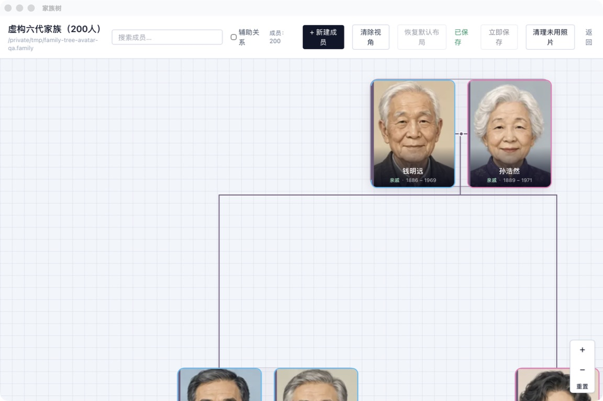

# 家族树 (Family Tree)

[](https://github.com/JingkaiTang/family-tree/actions/workflows/ci.yml)

一款面向中文家庭关系的本地优先应用。桌面与移动设备共用 Vue 网页界面和领域逻辑，通过 Web/PWA 使用用户授权的普通目录。项目只分发网页，不再维护原生桌面或移动应用。



> 截图使用仓库内的虚构测试数据和合成头像，不包含真实个人信息。

> **项目状态：Alpha。** 支持纯静态部署，无需应用账号或业务后端。尚未承诺稳定数据格式。请定期导出 `.familybundle` 备份；本地项目数据不加密。

[Web 部署与使用](docs/web-deployment.md) · [存储接口](docs/storage.md) · [架构说明](docs/architecture.md) · [依赖管理](docs/dependencies.md) · [项目格式](docs/project-format.md) · [发布说明](docs/releasing.md) · [贡献指南](CONTRIBUTING.md) · [安全政策](SECURITY.md) · [更新记录](CHANGELOG.md)

## 功能

- **复用原有页面**：Web PC 沿用原客户端的 `FamilyCanvas` 家族网格；移动 Web 沿用原移动端的 `FocusFlowView` 聚焦纵流。用户可切换布局，窗口缩放或手机旋转不自动重置选择。
- **复杂家庭结构**：支持当前及历史配偶、养育/继亲、次要父母和干亲等关系。
- **中文亲属称谓**：计算常见的直系、旁系与姻亲称谓，并支持按家庭习惯自定义覆盖。不同地区和家庭的称谓存在差异，自动结果仍需使用者确认。
- **成员资料管理**：记录姓名、性别、出生日期、照片、籍贯和职业等信息。
- **本地优先**：支持目录 API 的桌面和移动浏览器直接读写自选普通文件夹。应用不自动上传或跨设备同步。
- **数据可靠性**：打开和保存时校验项目，保留三份滚动备份；浏览器发现外部内容变化时停止覆盖，照片删除前保留回收副本。
- **可安装网页**：PWA 缓存静态应用供离线打开，项目和照片仍在用户目录；更新等待所有旧窗口关闭，不强制刷新编辑页面。
- **迁移与扩展**：延续 `.family` 目录和 `.familybundle` 格式，兼容已有项目与备份；统一 IO 接口为后续 Google Drive 适配保留边界，当前未接入云盘。

## 快速开始

### 环境要求

- 推荐 Node.js 24 LTS；支持 22.12+（22.x）、24.x 或 26+。
- Web 使用支持 `showDirectoryPicker` 的浏览器；推荐近期稳定版桌面 Chrome/Edge，Android Chrome 132+ 需目标设备验收。Safari/iOS Safari 和 Firefox 当前不在 Web 支持范围，不提供 OPFS 降级。

### 开发与构建

```bash
npm ci
npm run dev
```

在 localhost 打开后即可新建/打开普通目录、编辑成员和管理照片。发布时将 `npm run build` 生成的 `dist/` 部署到 HTTPS 静态主机。不需要原生工具链、Google 权限、API 密钥或购买域名。子目录、PWA 和浏览器限制见 [Web 部署说明](docs/web-deployment.md)。

### 验证改动

```bash
npm test
npm run build
npm run test:e2e
npm run test:layout-perf
```

`test:e2e` 使用真实 Chromium，系统目录选择器由测试句柄替代，不能替代 Android/桌面系统选择器真机验收；环境准备见 [贡献指南](CONTRIBUTING.md)。`test:layout-perf` 使用确定性的 500 人虚构家谱执行性能门禁，建议单独运行。

## 技术概览

| 层 | 技术 |
|---|---|
| Web/PWA 与本地目录 | File System Access API、静态应用缓存 |
| 网页界面 | Vue 3、TypeScript、Pinia、Tailwind CSS |
| 数据与校验 | JSON、Zod、版本迁移与本地备份 |
| 家族树 | 家族网格与聚焦纵流双布局、共享家庭事实、Web Worker |
| 测试 | Vitest、Playwright/Chromium、类型检查与 npm audit |

核心领域逻辑位于 `src/core`，Vue 组件负责交互编排，统一存储接口连接浏览器目录，并允许后续添加云盘提供商。不支持普通目录 API 的浏览器目前无法使用项目存储功能。中文称谓与两套布局共享领域逻辑，大型网格计算通过 Web Worker 运行。完整边界见 [架构文档](docs/architecture.md)。

## 参与贡献

欢迎通过 Issue 和 Pull Request 参与。请先阅读 [贡献指南](CONTRIBUTING.md) 和 [行为准则](CODE_OF_CONDUCT.md)。

请勿提交真实家谱、照片、住址或其他个人信息；安全漏洞请按 [安全政策](SECURITY.md) 私下报告。

## 许可

本项目采用 [MIT License](LICENSE)。
